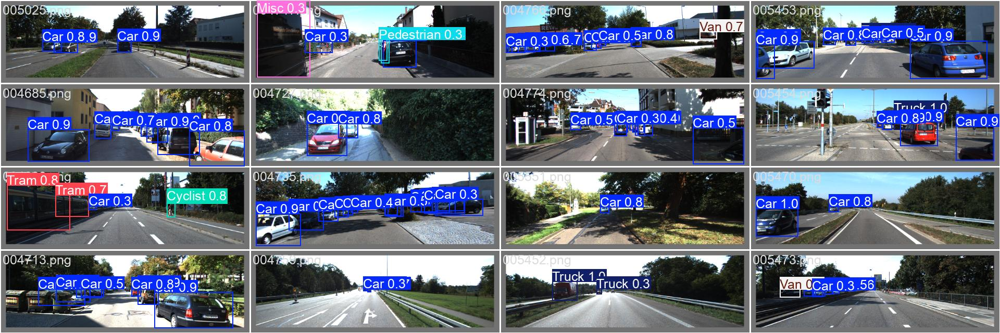

# 🚗 YYOLOv8: Custom Object Detection & Edge-Optimized on KITTI Dataset. 

YOLO-KITTI: 30 % pruned, INT8 TensorRT pipeline delivering 0.822 mAP @ 8.6 ms for real-time ADAS deployment

[](https://github.com/ultralytics/ultralytics)
[](https://www.python.org/)
[](LICENSE)
[](https://colab.research.google.com/)

A complete object detection pipeline built using [Ultralytics YOLOv8](https://docs.ultralytics.com/) on the [KITTI dataset](http://www.cvlibs.net/datasets/kitti/). This notebook-based project includes everything from training and evaluation to model pruning, quantization, and export for deployment.
###Still working on it to match the indusry standard

## 📦 Features

✅ YOLOv8n object detection  
✅ KITTI dataset pre-processing  
✅ mAP and confusion matrix evaluation  
✅ Global & Structured model pruning  
✅ ONNX + ONNX-INT8 quantization  
✅ TensorRT engine export for deployment


## 📁 Project Structure

```
📂 your-repo/
├── object_detection.ipynb          ← Main Colab notebook
├── kitti.yaml                      ← Dataset configuration
├── /kitti_data/                    ← training outputs and others
│   ├── yolov8n-kitti/              ← Training results
│   ├── Pruned/                     ← Pruned model weights
│   ├── Pruned_Quantized/           ← Quantized ONNX models
│   └── engine/                     ← TensorRT INT8 engines
│   └── edge-matrix/                ← edge_matrices csv file
│   └── Pareto-Result/              ← working.....
```
## 🔧 Setup

Install required dependencies:

```bash
# Core dependencies
pip install -q ultralytics tqdm onnx onnxruntime onnxruntime-tools

# GPU-enabled PyTorch
pip install -q torch torchvision torchaudio --index-url https://download.pytorch.org/whl/cu118

# For pruning, quantization, and TensorRT
pip install -q torch-pruning nvidia-ml-py3 nvidia-pyindex nvidia-tensorrt pycuda
```

> ⚠️ **Note**: TensorRT export and inference require an NVIDIA GPU (T4, A100, etc.) with CUDA installed.

## 📚 Dataset: KITTI

This project uses the [KITTI Vision Benchmark Suite](http://www.cvlibs.net/datasets/kitti/) — a dataset containing diverse traffic scenarios captured from a car-mounted camera.

**Detected Classes:**
- Car
- Pedestrian
- Van
- Cyclist
- Truck
- Misc
- Tram
- Person Sitting

## 🧠 Model Overview

- **Model**: YOLOv8n (Nano)
- **Epochs**: 15  
- **Input Size**: 640x640  
- **Total Parameters**: ~3M  

### 🏆 Evaluation Metrics

| Metric                |           Value            |
|-----------------------|----------------------------|
| **mAP@0.5**           | **0.822**                  |
| **Latency (T4)**      | **8.6 ms**                 |
| **Model size (INT8)** | **3.1 MB**                 |
| **Pruned channels**   | **30 %**                   |
| **Edge tested**       | Jetson-like (T4 throttled) |


## 🚀 Inference Examples

**Colab Prediction Output**:
```
0: 640x640 2 Cars, 4 Pedestrians, 2 Cyclists, 2.5ms
1: 640x640 1 Pedestrian, 2.5ms
...
```

**Python Prediction:**
```python
from ultralytics import YOLO

model = YOLO("path/to/best.pt")
results = model("path/to/image.png")
results.show()
```

**ONNX Inference:**
```python
import onnxruntime as ort
import numpy as np

session = ort.InferenceSession("best.onnx")
input_name = session.get_inputs()[0].name
dummy = np.random.randn(1, 3, 640, 640).astype(np.float32)
outputs = session.run(None, {input_name: dummy})
```
## 🪓 Model Pruning

Pruned using [`torch-pruning`](https://github.com/VainF/Torch-Pruning):

- Global Magnitude Pruning (`30%`)
- Structured Pruning on Conv layers

```python
import torch_pruning as tp

pruner = tp.pruner.MetaPruner(
    model, example_input,
    importance=tp.importance.MagnitudeImportance(p=2),
    global_pruning=True,
    pruning_ratio=0.30,
    ignored_layers=[model.model[-1]]  # keep Detect head
)
pruner.step()
```
## 🧪 Quantization & Export

### ONNX Export:
```python
model.export(format='onnx')
```

### INT8 Quantization:
```python
from onnxruntime.quantization import quantize_dynamic, QuantType

quantize_dynamic(
    model_input="best.onnx",
    model_output="best_int8.onnx",
    weight_type=QuantType.QInt8
)
```

### TensorRT Export:
```python
model.export(format='engine', dynamic=False, int8=True)
```
## 📦 Model Files

| Format      | Path                                                    | Size     |
|-------------|---------------------------------------------------------|----------|
| PyTorch     | `yolov8n-kitti/exp/weights/best.pt`                     | ~6.2  MB |
| ONNX        | `kitti_data/Pruned/best_int8.onnx`                      | ~11.7 MB |
| ONNX-INT8   | `Pruned_Quantized/After_Quant_best_int8.onnx`           | ~3.2  MB |
| TensorRT    | `engine/pruned_int8.engine`                             | ~6.7  MB |

## 📷 Visualizations

### 📌 Sample Results
<div align="center">
  
  <p><em>YOLOv8 detecting Cars, Pedestrians, Cyclists</em></p>
</div>

## 📚 References

- [Ultralytics YOLOv8 Docs](https://docs.ultralytics.com)
- [KITTI Dataset](http://www.cvlibs.net/datasets/kitti/)
- [ONNX Runtime Quantization](https://onnxruntime.ai/docs/performance/quantization.html)
- [Torch Pruning](https://github.com/VainF/Torch-Pruning)
- [Netron Visualizer](https://netron.app)

## 📝 License

This project is licensed for **educational and research use only**.  
Please follow the terms of the [KITTI dataset license](http://www.cvlibs.net/datasets/kitti/index.php#download).

---

## 👤 Author

**Md Ifte Khairul Islam**  
📧 iftekharislam111@gmail.com 
📅 _Last updated: 23rd July 2025_
